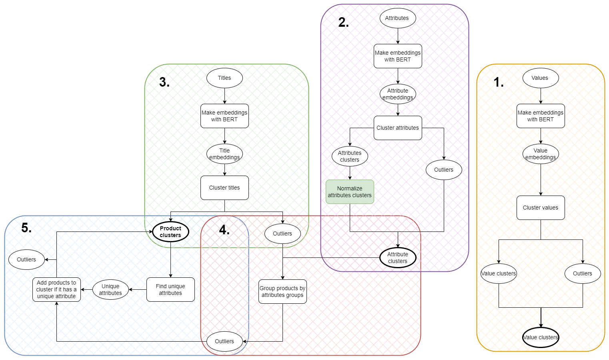

# Master_Thesis

On this GitHub page, all code that has been used in my master thesis can be found.
The two jupyter notebooks are very similar. The only difference is the normalization and where the resulting files are saved.

The 'no_norm' and 'norm' folders contain all the results that have been obtained in the different phases of the experiment (see the image of the pipeline below):
- Phase 1: step 1, 2,3
- Phase 2: step 4
- Phase 3: step 5

